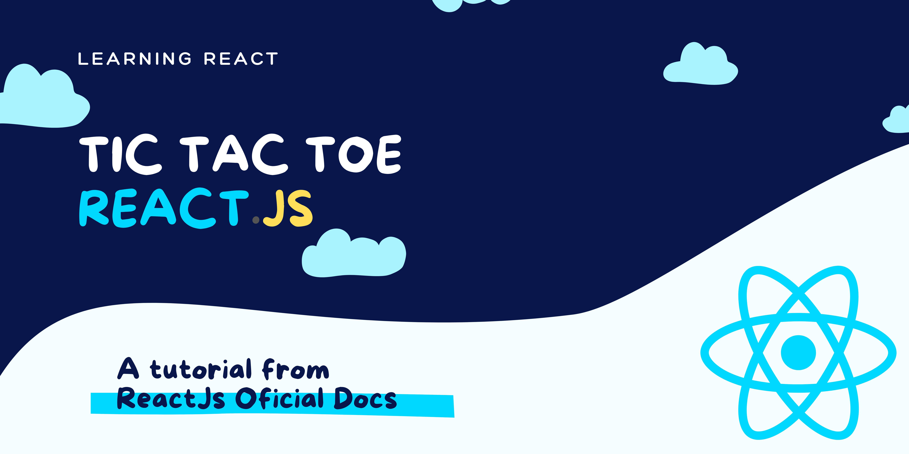

<center>



#  | TIC TAC TOE React.Js | 

## &#128679; Em desenvolvimento... &#128421;

</center>

---

## Sobre

Projeto desenvolvido com intuito de completar o _'Tutorial'_ com _ReactJs_ disponibilizado na documentação oficial da ReactJs.

  

 [](https://github.com/Gustavo-Apolonio) [](https://svgshare.com/i/Zhy.svg)

---

### Features

- [x] Jogar Jogo da Velha.
- [x] Indica quando uma dos jogadores ganhou.
- [x] Armazenar histórico do jogo conforme avança.
- [x] Revisar o histórico do jogo com outras versões do tabuleiro.

### Challenges

- [ ] Mostrar a localização de cada jogada no formato (col, row), para cada jogada no histórico.
- [ ] Estilizar com negrito o item da lista de jogadas que está selecionado no momento.
- [ ] Reescrever o componente Board para utilizar 2 loops para fazer os quadrados, em vez de deixá-los hardcoded.
- [ ] Adicionar um botão de toggle que lhe permita ordenar os jogadas em ordem ascendente ou descendente.
- [ ] Quando alguém ganhar, destaque os 3 quadrados que causaram a vitória.
- [ ] Quando ninguém ganhar, exiba uma mensagem informando que o resultado foi um empate.

---

### Pré-requisitos

Antes de começar, você vai precisar ter instalado em sua máquina as seguintes ferramentas:
[Git](https://git-scm.com/downloads), [NodeJs](https://nodejs.org/en/download/), [NPX](https://www.npmjs.com/package/npx) e o [Yarn](https://classic.yarnpkg.com/en/docs/install/). É recomendado que se tenha um editor para trabalhar com o código como [VSCode](https://code.visualstudio.com/Download)!

#### Rodando o projeto

```bash
# Clone este repositório
$ git clone https://github.com/Gustavo-Apolonio/react-tic-tac-toe.git

# Acesse a pasta do projeto no terminal/cmd
$ cd react-tic-tac-toe

# Caso queira editar algum código, abra o VsCode com
$ code .

# 'Builde' o projeto, para puxar os pacotes necessário novamente
$ npm i

# E então, no terminal ainda, inicie o server
$ npm start 
# Ou
$ yarn start

# O servidor inciará na porta:5001 - acesse <http://localhost:5001>
```

---

### Recursos

| Tecnologia | [](####recursos) |
|---|---|
| JavaScript | [](https://developer.mozilla.org/pt-BR/docs/Web/JavaScript) |
| ReactJs | [](https://pt-br.reactjs.org/) |
| HTML5 | [](https://developer.mozilla.org/pt-BR/docs/Web/HTML) |
| CSS3 | [](https://developer.mozilla.org/pt-BR/docs/Web/CSS) |
| Boostrap | [](https://getbootstrap.com/) |
| StyledComponents | [](https://styled-components.com/)

---

### Autor

<a href="https://github.com/Gustavo-Apolonio">
 
 <br />
 <sub>
  <b>Gustavo Apolonio</b>
 </sub>
</a>

&#128075; Entre em contato!

[](https://github.com/Gustavo-Apolonio)
[](https://www.linkedin.com/in/gustavo-apolonio-4206451b7/)
[](https://api.whatsapp.com/send?phone=5511951488854&text=Ol%C3%A1%20Gustavo.%20Te%20encontrei%20pelo%20GitHub!)
[](mailto:gustavo.apolonio.nascimento@gmail.com)

## [README em português 🇧🇷](./README.md)


# Getting Started with Create React App

This project was bootstrapped with [Create React App](https://github.com/facebook/create-react-app).

## Available Scripts

In the project directory, you can run:

### `yarn start`

Runs the app in the development mode.\
Open [http://localhost:3000](http://localhost:3000) to view it in the browser.

The page will reload if you make edits.\
You will also see any lint errors in the console.

### `yarn test`

Launches the test runner in the interactive watch mode.\
See the section about [running tests](https://facebook.github.io/create-react-app/docs/running-tests) for more information.

### `yarn build`

Builds the app for production to the `build` folder.\
It correctly bundles React in production mode and optimizes the build for the best performance.

The build is minified and the filenames include the hashes.\
Your app is ready to be deployed!

See the section about [deployment](https://facebook.github.io/create-react-app/docs/deployment) for more information.

### `yarn eject`

**Note: this is a one-way operation. Once you `eject`, you can’t go back!**

If you aren’t satisfied with the build tool and configuration choices, you can `eject` at any time. This command will remove the single build dependency from your project.

Instead, it will copy all the configuration files and the transitive dependencies (webpack, Babel, ESLint, etc) right into your project so you have full control over them. All of the commands except `eject` will still work, but they will point to the copied scripts so you can tweak them. At this point you’re on your own.

You don’t have to ever use `eject`. The curated feature set is suitable for small and middle deployments, and you shouldn’t feel obligated to use this feature. However we understand that this tool wouldn’t be useful if you couldn’t customize it when you are ready for it.

## Learn More

You can learn more in the [Create React App documentation](https://facebook.github.io/create-react-app/docs/getting-started).

To learn React, check out the [React documentation](https://reactjs.org/).

### Code Splitting

This section has moved here: [https://facebook.github.io/create-react-app/docs/code-splitting](https://facebook.github.io/create-react-app/docs/code-splitting)

### Analyzing the Bundle Size

This section has moved here: [https://facebook.github.io/create-react-app/docs/analyzing-the-bundle-size](https://facebook.github.io/create-react-app/docs/analyzing-the-bundle-size)

### Making a Progressive Web App

This section has moved here: [https://facebook.github.io/create-react-app/docs/making-a-progressive-web-app](https://facebook.github.io/create-react-app/docs/making-a-progressive-web-app)

### Advanced Configuration

This section has moved here: [https://facebook.github.io/create-react-app/docs/advanced-configuration](https://facebook.github.io/create-react-app/docs/advanced-configuration)

### Deployment

This section has moved here: [https://facebook.github.io/create-react-app/docs/deployment](https://facebook.github.io/create-react-app/docs/deployment)

### `yarn build` fails to minify

This section has moved here: [https://facebook.github.io/create-react-app/docs/troubleshooting#npm-run-build-fails-to-minify](https://facebook.github.io/create-react-app/docs/troubleshooting#npm-run-build-fails-to-minify)
